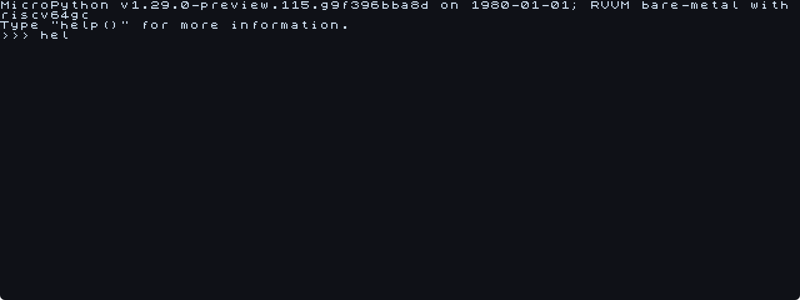

# scev-micropython

MicroPython on RVVM bare-metal — UART REPL plus a Bochs gfx_text
terminal grid driven by the GUI window's HID keyboard. About 300
lines of port glue on top of [rvvm-hal](https://github.com/SolAstrius/rvvm-hal).



```
$ rvvm firmware.bin -bochs_display -nonet -nosound

scev-micropython — MicroPython on RVVM bare-metal
heap=256 KiB  gfx=bochs+gfx_text  hartid=0
Type help() for a quick tour.

MicroPython v1.29.0-preview.115.g9f396bba8d on 1980-01-01; RVVM bare-metal with riscv64gc
Type "help()" for more information.
>>> for i in range(10): print(i, i*i)
0 0
1 1
2 4
…
>>>
```

## What works

- **REPL** with full readline (line editing, history) over both UART
  and the in-window terminal grid simultaneously — they mirror, so
  scripted stdin works the same as keyboard typing
- **HID keyboard** translation: full PC layout, modifiers (Shift,
  Ctrl), arrow keys (emit `ESC [ A/B/C/D` for readline)
- **CTRL-C** raises `KeyboardInterrupt`
- **CTRL-D** at empty prompt cleanly poweroffs RVVM via `hal_exit(0)`
- **GC heap** 256 KiB, statically allocated in BSS (no malloc)
- **gc_collect** correctly spills RV64 callee-save regs (`s0-s11`)
  to the stack before the conservative scan, so live pointers held
  in registers don't get freed
- **80×30 grid**, font_8x8 at scale 2 → 1280×480 surface,
  page-flipped double buffer (no tearing on rapid output)
- **ANSI parser** in the in-grid renderer handles the subset readline
  emits: `\b`, `\r`, `\n`, `\x07`, `ESC[K`, `ESC[2K`, `ESC[N{C,D}`,
  `ESC[r;cH`, `ESC[2J` — UART side gets every byte unchanged

## What doesn't (yet)

- **Floats**: `MICROPY_FLOAT_IMPL_NONE`. `1/2 == 0`, no `math` module.
  Flip the config knob + add libm to enable.
- **Filesystem**: every `import` becomes ENOENT. Adding FatFs is one
  more set of `mp_lexer_new_from_file` / `mp_import_stat` overrides
  pointing at the HAL's NVMe + FatFs adapter.
- **Networking**: same — `socket` module not built; lwIP is opt-in
  via `HAL_LWIP=1`.
- **Threading**, **`time.sleep_ms` precision**, **frozen modules**.

## Build

```sh
git clone --recursive https://github.com/SolAstrius/scev-micropython
cd scev-micropython
nix develop ./vendor/rvvm-hal --command bash -c '
    make -C vendor/rvvm-hal picolibc-min &&  # one-time, ~30s
    make
'
```

`firmware.bin` lands at the repo root, ~150 KiB. The dependencies are:

- `zig 0.16.0` (used as `zig cc -target riscv64-freestanding-none`)
- `llvm-ar`, `llvm-objcopy` (in zig's nix output already)
- `python3` for MicroPython's QSTR pre-pass
- `rvvm` for running

The `nix develop ./vendor/rvvm-hal` shell ships all of those.

## Run

```sh
make run            # bochs_display: GUI window with the gfx_text grid
make run-headless   # -nogui: stdin/stdout REPL on the host terminal
make run-qemu       # qemu-system-riscv64 -M virt -bios none
```

## Architecture

```
            +---------------------+
 host kbd ->| HID i2c-hid driver  |--+
            +---------------------+  |
                                     v
                                +---------+
            +-----+         +-->| input   |--+
 host stdin |UART |--byte---+   | ring    |  |
            |     |             | 256-buf |  |
            +-----+             +---------+  |
                                             |
                                             v
                              +-----------------------+
                              | mp_hal_stdin_rx_chr() |
                              | (blocks here, drains  |
                              |  ring, pumps idle)    |
                              +-----------+-----------+
                                          |
                                          v
                              +-----------------------+
                              | pyexec_friendly_repl  |
                              | (MicroPython runtime) |
                              +-----------+-----------+
                                          |
                              +-----------v-----------+
                              | mp_hal_stdout_tx_strn |
                              +--+-----------------+--+
                                 |                 |
                             host UART        scev_term_putc()
                              (printf)          ANSI parser
                                                 |
                                                 v
                                           +-----------+
                                           | gfx_text  |
                                           | grid      |
                                           +-----------+
```

The blocking primitive is `mp_hal_stdin_rx_chr`. Its idle loop does
the per-frame work — drain UART, poll HID, render the grid, page-flip,
wfi-pace ~240 Hz — so the REPL itself drives everything. No frame
timer, no ISR, no second hart.

## Code layout

```
port/
├── main.c            kmain entry, GC init, REPL launch, gc_collect
├── mphalport.c       UART/HID/gfx_text glue, ANSI parser, ring buffer
├── mphalport.h       mp_hal_* declarations
├── mpconfigport.h    feature flags (no float, basic ROM level)
├── qstrdefsport.h    port-specific qstrs (currently empty)
├── font_8x8.h        ASCII font, vendored from rvvm-hal/examples/ui-hello/
└── Makefile          MP py.mk + zig cc + libhal + picolibc-min
```

## Why this exists

`rvvm-hal` already runs ZX Spectrum 48K, Game Boy, and GBA firmwares
with a 5-MHz Z80 / 4-MHz LR35902 / 16-MHz ARM7. A MicroPython REPL
in the same envelope is mostly an exercise: it proves the HAL
surface is rich enough to host an interactive language runtime
(GC, exceptions via setjmp, terminal I/O, ms-precision time) and
gives anyone tinkering with `rvvm-hal` a quick way to script the
hardware they're bringing up — `>>> peek(0x10000005)` on a UART
register beats writing C every time.
